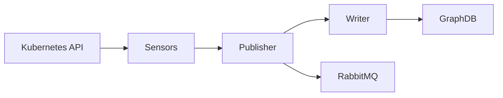

# Metis — Monitor Module

Metis is the **Monitor** phase of the AMoCNA MRE-K autonomic loop. It watches a Kubernetes cluster, translates structural events into SPARQL updates against a GraphDB knowledge base, and notifies Palamedes via RabbitMQ after each successful update.

---

## How it works



1. **Sensors** watch the Kubernetes API via Fabric8 informers — event-driven, no polling
2. **Publisher** buffers events for up to 500ms then flushes them as a batch
3. **Writer** translates each event into a SPARQL update and executes it against GraphDB
4. **RabbitMQ** receives a `GraphUpdateMessage` on the `amocna.graph.updates` queue after each successful batch
5. **Palamedes** consumes the message and triggers anomaly analysis

---

## Built-in sensors

| Sensor | Watches | CNEEOnt type | Events emitted |
|---|---|---|---|
| `PodSensor` | Pods | `cnee:ExecutionUnit` | EntityDiscovered, StateChanged, EntityDeleted |
| `ContainerImageSensor` | Pod container specs | `cnee:Container`, `cnee:Image` | EntityDiscovered, RelationshipAsserted (`contains`, `usesImage`) |
| `ServiceSensor` | Services | `cnee:Service` | EntityDiscovered, EntityDeleted |
| `NodeSensor` | Nodes | `cnee:Node` | EntityDiscovered, EntityDeleted |
| `BindingSensor` | Pods + Services | — | RelationshipAsserted: `cnee:contains`, `cnee:isHostedOn` |

### Pod state mapping

| Kubernetes phase | CNEEOnt state |
|---|---|
| Pending | `cnee:ExecutionUnitPending` |
| Running | `cnee:ExecutionUnitRunning` |
| Failed | `cnee:ExecutionUnitFailed` |
| Succeeded | `cnee:ExecutionUnitSucceeded` |
| Unknown | `cnee:ExecutionUnitUnknown` |

---

## RabbitMQ messages published

After each successful batch write to GraphDB, Metis publishes to:

- **Exchange:** `amocna.direct.exchange`
- **Routing key:** `graph.updates`
- **Queue:** `amocna.graph.updates`

**Message format (JSON):**
```json
{
  "resourceIri": "http://...CNEEOnt/Pod_default_my-pod",
  "ontologyType": "http://...CNEEOnt/ExecutionUnit",
  "changeKind": "CREATED",
  "correlationId": "metis-abc123-def456"
}
```

`changeKind` values: `CREATED`, `UPDATED`, `STATE_CHANGED`, `DELETED`

---

## Configuration

```yaml
spring:
  rabbitmq:
    host: ${RABBITMQ_HOST:localhost}
    port: ${RABBITMQ_PORT:5672}
    username: ${RABBITMQ_USER:guest}
    password: ${RABBITMQ_PASS:guest}

grpc:
  server:
    port: 50052

metis:
  graphdb:
    url: "http://graphdb:7200"
    repositoryId: "amocna"
    timeoutMs: 5000
  ontology:
    cneeNamespace: "http://www.semanticweb.org/szymo/ontologies/2026/2/CNEEOnt/"
  sensor:
    enabled: true
    namespaces: []          # empty = all namespaces
    batch-size: 50
    flush-interval-ms: 500
```

---

## Build

```bash
bash modules/metis/deployment/build.sh         # build image
bash modules/metis/deployment/build.sh --push   # build + push
```

## Deploy

```bash
bash modules/metis/deployment/k8s/deploy.sh
```

## Undeploy

```bash
bash modules/metis/deployment/k8s/undeploy.sh
```

## Test

```bash
cd modules/metis
mvn test
```

---

## Adding a new sensor

1. Create a class in `com.kubiki.metis.sensor.kubernetes`
2. Extend `AbstractNamespacedSensor` or implement `KubernetesSensor`
3. Annotate with `@Component` and `@ConditionalOnProperty(name = "metis.sensor.enabled", havingValue = "true")`
4. Inject `SensorEventPublisher` and call `publisher.publish(...)` from informer callbacks

Spring auto-discovers it — no other wiring needed.
