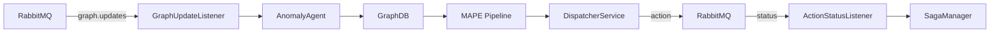

# Palamedes — Reasoner and Planner

Palamedes is the **Reason + Plan** phase of the AMoCNA MRE-K autonomic loop. It detects anomalies in the knowledge graph, plans remediation workflows, and dispatches actions to Themis for execution.

---

## How it works



1. **Metis** writes to GraphDB and publishes a `GraphUpdateMessage` to RabbitMQ
2. **GraphUpdateListener** receives the message and triggers `AnomalyAgent.analyze()`
3. **AnomalyAgent** queries GraphDB for resources in anomaly state and creates remediation workflows
4. **MAPE Pipeline** processes active workflows through a chain of pipes (validation, planning, dispatch)
5. **DispatcherService** sends `ActionMessage` to Themis via RabbitMQ
6. **Themis** executes the action and reports back via `ActionStatusUpdate`
7. **ActionStatusListener** receives the status and forwards to `SagaManager` for workflow state transitions

---

## RabbitMQ messages

### Consumed

| Queue | Message type | Action taken |
|---|---|---|
| `amocna.graph.updates` | `GraphUpdateMessage` | Triggers anomaly analysis immediately |
| `amocna.status.queue` | `ActionStatusUpdate` | Updates workflow state via SagaManager |

### Published

| Queue | Message type | When |
|---|---|---|
| `amocna.action.queue` | `ActionMessage` | When a planned action is ready for execution |

---

## Message formats

### `GraphUpdateMessage` (consumed from Metis)

```json
{
  "resourceIri": "http://...CNEEOnt#Pod_default_my-pod",
  "ontologyType": "http://...CNEEOnt#ExecutionUnit",
  "changeKind": "CREATED | UPDATED | STATE_CHANGED | DELETED",
  "correlationId": "metis-abc123"
}
```

### `ActionMessage` (published to Themis)

```json
{
  "actionId": "action-a1b2c3d4e5f6",
  "protocol": "HTTP | KUBERNETES",
  "instruction": "http://target-service:8080/api/restart",
  "method": "POST",
  "payload": "{}",
  "authMechanism": "NONE",
  "timeoutSeconds": 30,
  "isIdempotent": true,
  "maxRetries": 3,
  "expectedStatusCode": 200
}
```

### `ActionStatusUpdate` (consumed from Themis)

```json
{
  "actionId": "action-a1b2c3d4e5f6",
  "status": "SUCCESS | FAILURE | TIMEOUT",
  "errorMessage": null,
  "observedStatusCode": 200
}
```

---

## Triggering strategy

- **Event-driven (primary):** Each `GraphUpdateMessage` from Metis triggers `AnomalyAgent.analyze()` immediately
- **Fallback poll (safety net):** If no message arrives for 10 minutes, a scheduled task runs the analysis anyway — catches missed events after RabbitMQ outages

---

## Configuration

```yaml
spring:
  rabbitmq:
    host: ${RABBITMQ_HOST:localhost}
    port: ${RABBITMQ_PORT:5672}
    username: ${RABBITMQ_USER:guest}
    password: ${RABBITMQ_PASS:guest}

palamedes:
  graphdb:
    url: ${GRAPHDB_URL:http://localhost:7200}
    repository-id: ${GRAPHDB_REPO:amocna}
    timeout-ms: ${GRAPHDB_TIMEOUT:5000}
  prometheus:
    url: ${PROMETHEUS_URL:http://localhost:9090}
  engine:
    pipeline-rate-ms: 5000
```

---

## Build

```bash
bash modules/palamedes/deployment/build.sh         # build image
bash modules/palamedes/deployment/build.sh --push   # build + push
```

## Deploy

```bash
bash modules/palamedes/deployment/k8s/deploy.sh
```

This deploys:
- RabbitMQ (shared message broker)
- Palamedes application
- ClusterIP service on port 8081

## Undeploy

```bash
bash modules/palamedes/deployment/k8s/undeploy.sh
```

---

## Dependencies

| Service | Purpose | In-cluster URL |
|---|---|---|
| GraphDB | Knowledge base queries | `http://graphdb.graphdb.svc.cluster.local:7200` |
| RabbitMQ | Message broker | `rabbitmq.palamedes.svc.cluster.local:5672` |
| Prometheus | Metric condition evaluation | `http://prometheus.monitoring.svc.cluster.local:9090` |

---

## Observing

```bash
# Palamedes logs
kubectl logs -f deployment/palamedes -n palamedes

# RabbitMQ management UI (guest/guest)
kubectl port-forward svc/rabbitmq 15672:15672 -n palamedes
# Open http://localhost:15672
```
