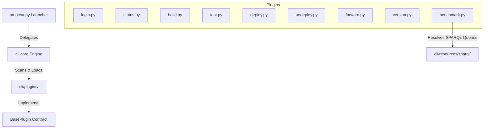

# AMoCNA Orchestration CLI Guide

Welcome to the **AMoCNA Unified Orchestration Command Line Interface (CLI)** documentation. This guide details the extensible, modular architecture of the CLI, explaining how to operate the orchestration system, build/test/deploy the platform, and execute sophisticated autonomic computing benchmarks.

---

## 1. Architectural Design Principles

The AMoCNA CLI has been refactored from a monolithic script into an **Open-Closed Principle (OCP)** compliant, highly modular package. This design isolates concerns, enables seamless dynamic extensibility, and separates domain logic from infrastructural assets.



### 1.1 Core Components

- **Root Launcher (`/amocna.py`)**: Re-executes via `uv run` when the package is not installed; otherwise calls `amocna_cli.main`.
- **CLI package (`/src/amocna_cli/`)**: Typer-based commands (`commands/`), shared config (`config.py`), and kubectl helpers (`utils/shell.py`).
- **External SPARQL Templates (`/cli/resources/sparql/`)**: Zero-logic, pure SPARQL files used by the benchmark command.

---

## 2. The Open-Closed Plugin Contract

To add a new subcommand to the CLI, you do not need to modify any core files. You only need to create a new Python module in `/cli/plugins/`.

### 2.1 The `BasePlugin` Base Class

Every subcommand is represented by a class extending `BasePlugin`:

```python
from abc import ABC, abstractmethod
import argparse
from cli.core import ProjectConfig

class BasePlugin(ABC):
    """Abstract Base Class defining the contract for all AMoCNA CLI subcommand plugins."""

    @abstractmethod
    def register(self, subparsers: argparse._SubParsersAction) -> None:
        """Register subcommand parsers and their specific options."""
        pass

    @abstractmethod
    def execute(self, cfg: ProjectConfig, args: argparse.Namespace) -> None:
        """Execute subcommand logic."""
        pass
```

### 2.2 Writing a Custom Subcommand Plugin

Below is a reference implementation of a new subcommand `hello`:

Create a new file `/cli/plugins/hello.py`:

```python
import argparse
from cli.plugins.base import BasePlugin
from cli.core import ProjectConfig, header, info

class HelloPlugin(BasePlugin):
    """A hello world extension plugin demonstrating OCP compliance."""

    def register(self, subparsers: argparse._SubParsersAction) -> None:
        p_hello = subparsers.add_parser("hello", help="Prints hello message")
        p_hello.add_argument("--name", default="World", help="Who to greet")
        # Critical for dynamic dispatch: maps this subparser to the execution handler
        p_hello.set_defaults(handler=self.execute)

    def execute(self, cfg: ProjectConfig, args: argparse.Namespace) -> None:
        header("Executing Hello Plugin")
        info(f"Hello, {args.name}! Project root is currently: {cfg.project_root}")
```

Once saved, the plugin discovery engine will automatically discover it on the next command execution. Try running `./amocna.py hello --name Developer`.

---

## 3. Externalized SPARQL Resource Pattern

All SPARQL queries used in automated benchmarks have been externalized into `/cli/resources/sparql/`. This isolates raw graph-level RDF updates from orchestration procedures, simplifying queries and schema transitions.

### 3.1 Resolving Queries at Runtime

The benchmark command loads queries dynamically from disk:

```python
def _load_sparql_query(cfg: ProjectConfig, filename: str) -> str:
    path = cfg.project_root / "cli" / "resources" / "sparql" / filename
    return path.read_text().strip()
```

### 3.2 Dynamic Template Interpolation

For queries requiring dynamic values (e.g., K8s pod names), the template contains a standard string placeholder (such as `{pod_name}`), which is resolved programmatically before execution:

```python
# Load query containing Pod_sock-shop_{pod_name} placeholder
vulnerability_query = self._load_sparql_query(cfg, "inject-vulnerability.sparql")
# Resolve placeholder safely without violating SPARQL structural formatting
resolved_query = vulnerability_query.replace("{pod_name}", pod_name)
```

---

## 4. Command Reference

### `login`

Authenticate with the GitHub Packages registry.

```bash
./amocna.py login --user <username> [--registry <url>]
```

### `status`

Inspect the AMoCNA project setup, version parity, modules, and K8s services.

```bash
./amocna.py status
```

### `build`

Compile, containerize, and push AMoCNA applications.

```bash
./amocna.py build --app <app-name> [--push] [--tag <tag-version>]
./amocna.py build --all
```

### `test`

Run Maven-based integration and unit test suites.

```bash
./amocna.py test --app <app-name>
./amocna.py test --all
```

### `deploy`

Deploy the AMoCNA ontology store (GraphDB) along with core microservices to the Kubernetes cluster.

```bash
./amocna.py deploy --all
```

### `undeploy`

Safely purge K8s manifests, namespace setups, and (optionally) wipe GraphDB volumes.

```bash
./amocna.py undeploy [--keep-graphdb-data]
```

### `forward`

Establish local port forwarding to target microservices.

```bash
./amocna.py forward <shortcut-name> [--local-port <port>]
```

### `version`

Perform version synchronization across POM dependencies and K8s YAML deployment manifests.

```bash
./amocna.py version --bump [major|minor|patch] [--dry-run]
./amocna.py version --set <version-string>
```

---

## 5. Benchmarking and Scenario Orchestration

The `benchmark` subcommand provides automated control loops to run evaluation scenarios mapped directly to academic master's thesis standards.

```bash
./amocna.py benchmark [run|status|stop|load]
```

### 5.1 Scenario Descriptions

#### Scenario 1: Horizontal Scaling (Scale-Out)

- **Goal**: Evaluate autonomic response to sudden SLA breaches (response time spikes).
- **Process**: Generates traffic using 1,000 baseline users, then triggers a breach by boosting Locust concurrency to 3,000 users. It polls Kubernetes replica scaling metrics to verify the scale-out to 3 replicas.
- **Execution**:

  ```bash
  ./amocna.py benchmark run --scenario 1
  ```

#### Scenario 2: Vertical Scaling

- **Goal**: Evaluate vertical CPU resource adjustments under cluster compute pressure.
- **Process**: Generates baseline load (1,000 users), then scales compute stress pods (`cluster-stress`) to 3 replicas to generate node CPU pressure. The control loop polls container resource allocations until the `orders` service is vertically scaled.
- **Execution**:

  ```bash
  ./amocna.py benchmark run --scenario 2
  ```

#### Scenario 3: Autonomic Security Patching (Semantic Trigger)

- **Goal**: Test vulnerability remediation triggered via semantic ontology facts.
- **Process**: Queries active K8s pods, injects a security vulnerability assertion (`SecurityVulnerabilityDetectedState`) directly into the GraphDB knowledge graph, and monitors deployment image rolls to ensure version `0.3.1` (secured) is deployed.
- **Execution**:

  ```bash
  ./amocna.py benchmark run --scenario 3
  ```

#### Scenario 4: Multi-Step Saga Remediation (Red Path Rollback)

- **Goal**: Validate multi-component distributed transactions and error compensation procedures.
- **Process**: Creates a configuration state, alters the GraphDB restart execution instruction to deliberately trigger a failure (`FAIL_NOW`), and injects config drift facts (`ConfigDriftState`). The autonomic system executes Saga step 1, encounters step 2 failure, and cleanly rolls back step 1.
- **Execution**:

  ```bash
  ./amocna.py benchmark run --scenario 4
  ```

#### Scenario 5: End-to-End Container Vulnerability Remediation

- **Goal**: Detect a known vulnerable container image version via Metis sensors and a pluggable vulnerability catalog, then autonomically patch all affected deployments.
- **Process**: Resets `front-end` to vulnerable image `docker.io/weaveworksdemos/front-end:0.3.0`. Metis `ContainerImageSensor` writes `Container`/`Image`/`ImageRegistry` topology to GraphDB (no vulnerability facts). Palamedes periodically scans sensed images against the CVE catalog, selects a fix under upgrade policy (default `PATCH` → `0.3.12`), and fans out `ImageUpdateIntent` workflows; Themis runs `kubectl set image` with an explicit `docker.io/` prefix. The CLI polls until image `0.3.12` is deployed.
- **Upgrade policy** (`palamedes.vulnerability.upgrade-policy`): `PATCH` | `MINOR` | `MAJOR` controls which fix version Palamedes selects from the catalog.
- **Scan interval** (`palamedes.vulnerability.scan-interval-ms`, default 30s): how often Palamedes re-checks GraphDB images against the catalog.
- **Execution**:
  ```bash
  ./amocna.py benchmark run --scenario 5
  ```

#### Scenario 6: Registry Credential Remediation

- **Goal**: Detect `ImagePullBackOff` on a workload pulling from a private registry, infer the correct `imagePullSecret` from a healthy sibling in the same namespace, and patch the failing Deployment.
- **Process**: Creates `regcred` in `sock-shop` (requires `AMOCNA_USER` and `AMOCNA_PAT` for `ghcr.io`), deploys `s6-sibling` (with `imagePullSecrets`) and `s6-failing` (without) both using the private `ghcr.io/amocna-kr/metis` image from the project POM version. Metis senses `ImagePullBackOffState` and topology; Palamedes runs sibling-secret inference; Themis patches `imagePullSecrets`. The CLI polls until `regcred` appears on the Deployment and the failing pod is `Running`, then removes benchmark workloads and graph triples.
- **Prerequisites**: AMoCNA stack on `1.7.6-SNAPSHOT` (or newer) with Scenario 6 ontology/blueprint loaded; cluster can pull `ghcr.io/amocna-kr/metis` when credentials are present.
- **Execution**:

  ```bash
  export AMOCNA_USER=your_github_user
  export AMOCNA_PAT=your_github_pat
  ./amocna.py benchmark run --scenario 6
  ```

### 5.2 Helper Routines

- **Status Check**: Inspect active workloads, pod counts, and Locust traffic parameters:

  ```bash
  ./amocna.py benchmark status
  ```

- **Instant Baseline Reset**: Scale down load testers, remove CPU pressure, delete GraphDB anomaly state triples, and restore base ontologies to baseline:

  ```bash
  ./amocna.py benchmark stop
  ```

- **Custom Traffic Loading**: Direct Locust swarming programmatically:

  ```bash
  ./amocna.py benchmark load --users 1500 --rate 25
  ```
