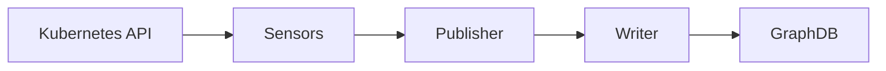

# Metis — Monitor Module

Metis is the **Monitor** phase of the AMoCNA MRE-K autonomic loop. It watches a Kubernetes cluster, translates structural events into SPARQL updates against a GraphDB knowledge base, and notifies the reasoning module after each successful update.

---

## How it works



1. **Sensors** watch the Kubernetes API via Fabric8 informers — event-driven, no polling
2. **Publisher** buffers events for up to 500ms then flushes them as a batch
3. **Writer** translates each event into a SPARQL update
4. **GraphDB** stores the resulting RDF triples

External sensors can also push events via gRPC on port 50052 — they enter the same pipeline at the Publisher stage.

---

## Built-in sensors

| Sensor | Watches | CNEEOnt type | Events emitted |
|---|---|---|---|
| `PodSensor` | Pods | `cnee:ExecutionUnit` | EntityDiscovered, StateChanged, EntityDeleted |
| `ServiceSensor` | Services | `cnee:Service` | EntityDiscovered, EntityDeleted |
| `NodeSensor` | Nodes | `cnee:Node` | EntityDiscovered, EntityDeleted |
| `BindingSensor` | Pods + Services | — | RelationshipAsserted (`cnee:contains`, `cnee:isHostedOn`) |

### Pod state mapping

| Kubernetes phase | CNEEOnt state |
|---|---|
| Pending | `cnee:ExecutionUnitPending` |
| Running | `cnee:ExecutionUnitRunning` |
| Failed | `cnee:ExecutionUnitFailed` |
| Succeeded | `cnee:ExecutionUnitSucceeded` |
| Unknown | `cnee:Unknown` |

### IRI scheme

```
Pods / Services:  cnee:Pod_<namespace>_<name>       e.g. cnee:Pod_default_my-pod-abc
Nodes:            cnee:Node_<name>                  e.g. cnee:Node_kube-worker-1
```

---

## Configuration

All properties use the `metis.*` prefix. Override via environment variables using uppercase with underscores (e.g. `METIS_GRAPHDB_URL`).

```yaml
grpc:
  server:
    port: 50052             # gRPC port for external sensors

metis:
  graphdb:
    url: "http://graphdb:7200"
    repositoryId: "amocna"
    timeoutMs: 5000
  ontology:
    cneeNamespace: "http://www.semanticweb.org/szymo/ontologies/2026/2/CNEEOnt#"
  palamedes:
    host: "palamedes"
    port: 50051
  sensor:
    enabled: true
    namespaces: []          # empty = all namespaces; e.g. [default, hephaestus-business]
    batch-size: 50
    flush-interval-ms: 500
```

When `sensor.enabled=false`, no Kubernetes client is created — Metis runs without cluster access (useful for local dev and CI).

---

## Build

Requires Java 25, Maven 3.9+. Proto stubs are generated from `../../schema/` at compile time.

```bash
cd modules/metis
mvn package -DskipTests
```

### Docker

Build context must be the repo root (so `schema/` is available):

```bash
# From modules/metis
./build.sh

# Push to registry
./build.sh --push

# Custom registry
REGISTRY=myregistry ./build.sh --push
```

---

## Run locally

```bash
java -Dmetis.graphdb.url=http://localhost:7200 \
     -Dmetis.palamedes.host=localhost \
     -Dmetis.sensor.namespaces=hephaestus-business \
     -jar target/metis-0.0.1-SNAPSHOT.jar
```

Kubernetes credentials are resolved automatically by Fabric8: in-cluster service account → `KUBECONFIG` env var → `~/.kube/config`.

---

## Test

```bash
mvn test
```

No external services needed — GraphDB is simulated by WireMock, Palamedes by an in-process gRPC server, sensors are disabled via `application-test.yml`.

```bash
# PBT only
mvn test -Dtest="*PropertyTest"

# Integration only
mvn test -Dtest="*IT"
```

---

## Deploy to Kubernetes

### 1. Deploy GraphDB

```bash
bash Deployment/graphdb/k8s/deploy.sh
```

Access the workbench, create a repository with ID `amocna`, and import the CNEEOnt ontology manually.

```bash
# Port-forward for browser access
kubectl port-forward svc/graphdb 7200:7200 -n graphdb
```

### 2. Deploy the business demo (target namespace)

```bash
kubectl apply -f Deployment/business-demo/
```

### 3. Deploy Metis

```bash
bash Deployment/metis-demo/deploy.sh
```

This creates the `metis` namespace, a ServiceAccount with cluster-wide read access to pods/services/nodes, the Metis deployment, and a ClusterIP service.

### 4. Verify

```bash
kubectl logs -f deployment/metis -n metis
```

Expected output within a few seconds:
```
INFO  PodSensor watching namespaces: [hephaestus-business]
INFO  ServiceSensor watching namespaces: [hephaestus-business]
INFO  Palamedes should be notified [correlationId=..., resourceIri=cnee:Pod_..., changeKind=CREATED]
```

Query GraphDB to confirm triples were written:

```sparql
PREFIX cnee: <http://www.semanticweb.org/szymo/ontologies/2026/2/CNEEOnt#>
PREFIX rdf:  <http://www.w3.org/1999/02/22-rdf-syntax-ns#>

SELECT ?individual ?type WHERE {
  ?individual rdf:type ?type .
  FILTER(STRSTARTS(STR(?individual), STR(cnee:)))
}
ORDER BY ?type
```

### 5. Trigger sensor events

```bash
# Scale up — new pods → EntityDiscovered + StateChanged + RelationshipAsserted
kubectl scale deployment business-demo -n hephaestus-business --replicas=3

# Scale down — pods deleted → EntityDeleted
kubectl scale deployment business-demo -n hephaestus-business --replicas=1
```

---

## Adding a new sensor

1. Create a class in `com.kubiki.metis.sensor.kubernetes`
2. Extend `AbstractNamespacedSensor` (for namespaced resources) or implement `KubernetesSensor` directly (for cluster-scoped)
3. Annotate with `@Component` and `@ConditionalOnProperty(name = "metis.sensor.enabled", havingValue = "true")`
4. Inject `SensorEventPublisher` and call `publisher.publish(...)` from your informer callbacks

Spring auto-discovers it — no other wiring needed.

```java
@Component
@ConditionalOnProperty(name = "metis.sensor.enabled", havingValue = "true")
public class DeploymentSensor extends AbstractNamespacedSensor {

    private final SensorEventPublisher publisher;
    private final IriFactory iriFactory;

    public DeploymentSensor(KubernetesClient client, MetisProperties props,
                            SensorEventPublisher publisher, IriFactory iriFactory) {
        super(client, props);
        this.publisher = publisher;
        this.iriFactory = iriFactory;
    }

    @Override public String name() { return "DeploymentSensor"; }

    @Override
    protected SharedIndexInformer<Deployment> createInformer(KubernetesClient client, String namespace) {
        var op = namespace != null
                ? client.apps().deployments().inNamespace(namespace)
                : client.apps().deployments().inAnyNamespace();
        return op.inform(new ResourceEventHandler<>() {
            @Override public void onAdd(Deployment d) { /* publish EntityDiscoveredEvent */ }
            @Override public void onUpdate(Deployment o, Deployment n) { }
            @Override public void onDelete(Deployment d, boolean u) { /* publish EntityDeletedEvent */ }
        });
    }
}
```

---

## Palamedes notification

Palamedes notification is currently in **log-only mode** — after each successful batch, Metis logs what it would notify but does not make the gRPC call. This avoids errors when Palamedes is not yet deployed.

To enable: uncomment the `notifier.notify(...)` calls in `SensorEventPublisher` and `SensorIngestionGrpcService`, then update `METIS_PALAMEDES_HOST` in the deployment.

---

## Package structure

```
com.kubiki.metis
├── MetisApplication.java
├── config/
│   ├── MetisProperties.java          # all configuration properties
│   ├── GraphDBConfig.java            # RDF4J HTTPRepository bean
│   ├── GrpcClientConfig.java         # Palamedes channel + stub beans
│   └── KubernetesClientConfig.java   # Fabric8 client (conditional on sensor.enabled)
├── grpc/
│   └── SensorIngestionGrpcService.java   # external gRPC entry point
├── ingestion/
│   ├── SensorEventProcessor.java     # dispatches events to handlers
│   ├── handler/                      # one handler per event type
│   └── model/                        # HandlerResult, ProcessResult
├── knowledge/
│   ├── KnowledgeBaseWriter.java      # builds and executes SPARQL updates
│   ├── KnowledgeBaseException.java
│   └── OntologyRegistry.java
├── notification/
│   └── PalamedesNotifier.java        # fire-and-forget TriggerUpdate (currently log-only)
└── sensor/
    ├── KubernetesSensor.java          # extension point interface
    ├── SensorOrchestrator.java        # starts/stops all sensors on app lifecycle
    ├── SensorEventPublisher.java      # buffers and flushes event batches
    ├── IriFactory.java                # CNEEOnt IRI construction
    └── kubernetes/
        ├── AbstractNamespacedSensor.java
        ├── PodSensor.java
        ├── ServiceSensor.java
        ├── NodeSensor.java
        └── BindingSensor.java
```
